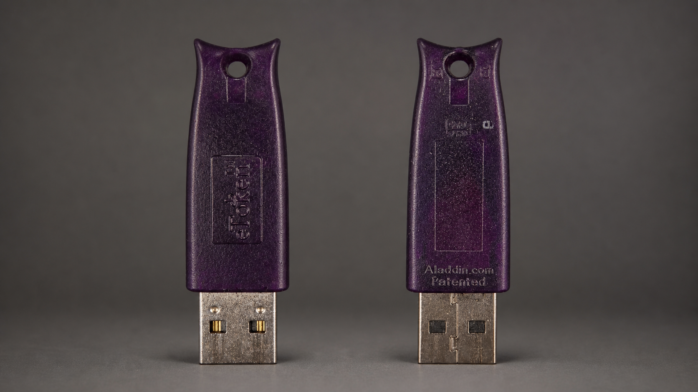

# eToken PRO (Java), профиль PRO: production APDU и полный E2E

Дата актуальной проверки: 27 августа 2026 года. Документ описывает только
обезличенный технический результат на собственном расходном тестовом контейнере.
PIN, серийный номер, метка носителя, пользовательские имена контейнеров и байты
закрытых ключей здесь намеренно отсутствуют.

Проверенный экземпляр снаружи маркирован как **eToken PRO**, а не JaCarta.
Имя backend `JaCartaProApdu` сохранено в коде: оно обозначает совместимый PRO-апплет
и восстановленный APDU-протокол, но не является названием корпуса или доказательством
тождественности более поздней модели JaCarta PRO.

## Точная идентификация

Live-инвентаризация точного физического носителя дала следующие независимые
признаки:

| Признак | Проверенное значение |
|---|---|
| PC/SC reader | `Aladdin Token JC 0` |
| USB | `VID_0529/PID_0620` |
| ATR | `3B D5 18 00 81 31 FE 7D 80 73 C8 21 10 F4` |
| PKCS#11 manufacturer | `Aladdin R.D.` |
| PKCS#11 model | `PRO` |
| hardware / firmware | `4.03` / `1.01` |
| механизмы PKCS#11 | 28 |
| маркировка лицевой стороны | `eToken PRO` |
| маркировка обратной стороны | `Aladdin.com` / `Patented` |
| коммерческая идентификация | eToken PRO (Java), профиль/апплет PRO; объём памяти текущим readback не установлен |
| внутреннее имя backend | `JaCartaProApdu` — техническое имя совместимого PRO-маршрута |

Строка reader, USB ID, ATR или model по отдельности недостаточны. Production gate
проверяет точную пару manufacturer/model, indexed reader и свежий ATR, а после
`SCardConnect` повторно сверяет ATR через `SCardGetAttrib` на том же handle до
первой APDU; USB ID независимо подтверждён PnP-инвентаризацией перед E2E. Если
обязательный сигнал отсутствует либо неоднозначен, `DirectTokenApdu` не отправляет
PRO APDU и не подставляет заводской PIN.

## Внешний вид и эталонные фотографии



Для быстрого визуального сравнения исходные фотографии сведены в кадр `16:9`:
лицевая сторона сверху, обратная снизу, оба штекера слева. Сам токен не
перерисовывался: использованы поворот, одинаковая обрезка и масштабирование исходных
пикселей на нейтральном фоне. Полный порядок обработки закреплён в
[runbook фотоколлажа](../runbooks/token-photo-collage.md), а параметры общей
контрастной нормализации и хэши — в [протоколе серии](../token-photo-series.md).

| Ракурс | Отличительные признаки | Доказательный файл | SHA-256 |
|---|---|---|---|
| Лицевая сторона | тёмно-фиолетовый вытянутый корпус, вогнутая верхняя кромка, круглое отверстие, вертикальный рельеф `eToken PRO` | [оригинал](../images/etoken-pro/etoken-pro-front-original.png) | `49D8FE08C673CEE3B13DA3F8EB7AB6617FCC9D3B65B7E7BCAE51B83E41B57543` |
| Обратная сторона | тот же корпус и отверстие, прямоугольное поле, рельеф `Aladdin.com` / `Patented` у USB-разъёма | [оригинал](../images/etoken-pro/etoken-pro-rear-original.png) | `0A6A4BD7AA71F0C337F0D97944AE5DF3D24C4346A24627D76657D0A71C633F26` |
| Сводный вид | лицевая сторона сверху, обратная снизу; штекеры слева, одинаковая компоновка `2048×1152` | [обработанный коллаж](../images/etoken-pro/etoken-pro-front-rear-studio.png) | `62C4C16EC6FDC2547FD0B38567415D6061BA7111AB43E220A6DA6E2CEAC189BB` |

Один корпус не доказывает электронную модификацию: для точного совпадения по-прежнему
нужны хотя бы USB ID, ATR и PKCS#11 manufacturer/model. Поэтому найденное на вторичном
рынке устройство с таким же корпусом считается визуальным кандидатом, пока продавец
не предоставил эти идентификаторы.

## Устройство CSP-раздела

Проверенный апплет имеет AID `A0000003120202`. Для выбранного тестового индекса
корень контейнера был `66665000E00E0B00`, а 20-байтовая соль сервиса читалась по
пути `66665000000F`. Внутри контейнера шесть EF:

| EF | Файл CryptoPro |
|---|---|
| `F001` | `masks.key` |
| `F002` | `primary.key` |
| `F003` | `header.key` |
| `F004` | `masks2.key` |
| `F005` | `primary2.key` |
| `F006` | `name.key` |

Это пассивный файловый CSP-раздел. Отдельные PKCS#11-возможности того же носителя
не превращают эти шесть файлов в аппаратные PKCS#11 private-key objects: на
актуальном снимке PKCS#11-объектов было ноль.

## Аутентификация без vendor `C_Login`

Прямой PC/SC-путь независимо воспроизводит протокол приложения CSP:

1. PIN кодируется UTF-16BE с завершающим нулевым символом.
2. Из PIN и 20-байтовой соли строится 24-байтовый ключ PKCS#12 SHA-1 KDF:
   diversifier `3`, 999 итераций.
3. Восьмибайтовый challenge шифруется 3DES-CBC с нулевым IV.
4. Криптограмма передаётся командой external authentication `80 11 00 11`.
5. Перед каждым защищённым `READ BINARY` выполняется новая аутентификация.

Ни PIN, ни производные ключи, ни challenge/cryptogram не логируются. Временные
секретные массивы зануляются после использования; уже собранные blob-файлы при
исключении зануляются до очистки словаря. При успехе blob-файлы передаются
конвейеру для сохранения результата.

## Адресный fail-closed выбор

Без PIN читается только публичный список. Каждый индекс получает технический ID
`jacartapro_XX`. Для `tokenexport` и `tokenfull` на проверенном PRO-профиле параметр
`--container <technical-id>` обязателен:

```text
CryptoProExport.exe list
CryptoProExport.exe tokenfull "Aladdin Token JC 0" <dir> <pin> \
  --container jacartapro_XX
```

Пользовательское имя не принимается как селектор и не используется в имени
выходной папки. До защищённого чтения код требует ровно одно полное совпадение
technical ID. Пропущенный, неизвестный, сокращённый или дублированный селектор
завершает команду кодом 1 без чтения защищённых EF.

Глобальные команды `export`/`full` и GUI-запуск без выбранной APDU-строки не имеют
technical selector. Если подключён этот PRO-профиль, они fail-closed завершаются
сразу после публичной инвентаризации и до первого защищённого чтения.

## E2E 27.08.2026

На носителе публично перечислялись три CSP-контейнера. Для теста был разрешён
только собственный синтетический двухключевой контейнер с technical ID
`jacartapro_02`; защищённые EF двух остальных не читались.

Исходное состояние синтетического контейнера:

- обмен: `KP_PERMISSIONS=0x00130898`;
- подпись: `KP_PERMISSIONS=0x00122898`;
- штатный `csptest -keycopy` токен → HDIMAGE: `0x8009000B`
  (`NTE_BAD_KEY_STATE`);
- целевая HDIMAGE-копия после отказа отсутствовала.

Первый production-запуск с точным селектором безопасно прочитал только шесть
файлов и остановил `keyexport`, потому что у нового контейнера ещё не было
сертификатов. После создания двух самоподписанных тестовых сертификатов повторный
адресный `tokenfull` завершился кодом 0 и прочитал:

| Файл | Размер |
|---|---:|
| `masks.key` / `masks2.key` | по 56 байт |
| `primary.key` / `primary2.key` | по 70 байт |
| `header.key` | 199 байт |
| `name.key` | 15 байт |

Двухфазная нормализация создала отдельные одноключевые копии обмена и подписи.
Обе установлены по точным HDIMAGE-путям и проверены через CryptoAPI:

- обмен: `0x0013089C`;
- подпись: `0x0012289C`;
- для каждой копии `topfx` создал PFX;
- `certutil -dump` принял оба файла;
- OpenSSL подтвердил MAC, `Shrouded Keybag` и `Certificate bag` в обоих PFX.

После проверки удалены оба PFX, обе HDIMAGE-копии, два временных сертификата и
сам синтетический контейнер. Публичный readback показал его отсутствие; два
остальных имени сравнивались только по хешу и остались неизменны. Флаги
`COUNT_LOW`, `FINAL_TRY` и `LOCKED` после уборки не установлены.

## Повторная проверка на неэкспортируемом контейнере — 11.09.2026

На том же exact-target `Aladdin Token JC 0` (`VID_0529/PID_0620`, ATR
`3B D5 18 00 81 31 FE 7D 80 73 C8 21 10 F4`, PKCS#11 `Aladdin R.D.` / `PRO`)
заново создан синтетический контейнер `cpxt_codex_20260911b`. Публичный список
показал его как `[APDU jacartapro_00]`; `checkexport` подтвердил исходное состояние:

- обмен: `KP_PERMISSIONS=0x00130898`, `CRYPT_EXPORT` отсутствует;
- подпись: `KP_PERMISSIONS=0x00122898`, `CRYPT_EXPORT` отсутствует.

Адресный запуск production-команды
`tokenfull "Aladdin Token JC 0" <dir> --container jacartapro_00`
с явным PIN (значение PIN в документацию не записывается) завершился кодом `3`:
`eToken PRO (Java) / PRO APDU вернул SERVICE_SALT_LENGTH`.

Независимая read-only APDU-проверка перед этим запуском получила успешные статусы
`0x9000` на `SELECT` и `READ` service-salt, но длина данных ответа составила 43 байта.
Текущая реализация `JaCartaProApdu` принимает только 20 байт и останавливается до
защищённых `READ BINARY`; выходная папка осталась пустой, а повторный `checkexport`
показал те же `…98`. Это несовместимость формата ответа соли с текущим декодером, а
не признак экспортируемости ключа или повреждения контейнера.

Повторный read-only обмен уточнил структуру: ответ `SELECT` service-salt содержит
метаданные EF с размером `0x2B` (43), а `READ` возвращает ровно эти 43 байта
содержимого, включая последние `00 0F 0F`; это не двухбайтовый status word и не
добавочный транспортный хвост. Следовательно, для этого варианта токена солью
является весь payload EF. Совместимый декодер должен принимать целиком 20-байтовый
вариант старой ревизии и целиком 43-байтовый вариант этой ревизии; отбрасывание
байтов до 20 запрещено, потому что может дать неверный challenge-response и расход
PIN-попытки.

## Граница результата

Для этого точного eToken PRO с апплетом PRO CSP-контейнер снимается полностью:
`tokenfull → p12utility → HDIMAGE → PFX`. Это не обещание экспорта отдельного
аппаратного PKCS#11 private key и не перенос результата на похожие JaCarta без
совпадения точной модели, производителя, reader и ATR.

Официальное EOL-извещение «Аладдин Р.Д.» перечисляет eToken PRO (Java) как
отдельную линейку и называет JaCarta PRO её совместимой заменой. Это подтверждает
границу терминов, но не позволяет по одному корпусу определить объём 32K/72K или
точную ревизию:

- [EOL eToken PRO/eToken и программа миграции на JaCarta](https://www.aladdin-rd.ru/public/files/EOL_eToken_PRO_eToken_eToken_GOST_v5_1.pdf);
- [руководство Единого Клиента JaCarta 2.13](https://aladdin-rd.ru/upload/downloads/JaCarta_UC/JaCarta_UC_2.13_User.Guide%28Windows%29.pdf).

Исторические исследовательские трассы помогли восстановить протокол, но содержали
идентификаторы и тестовые образцы ключевого материала. Они удалены из Git; для
регрессии остаются только публичные криптографические векторы и синтетические
юнит-тесты без данных владельца.
