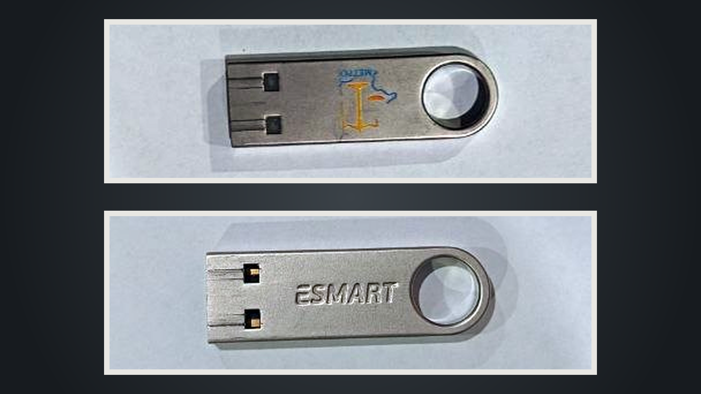
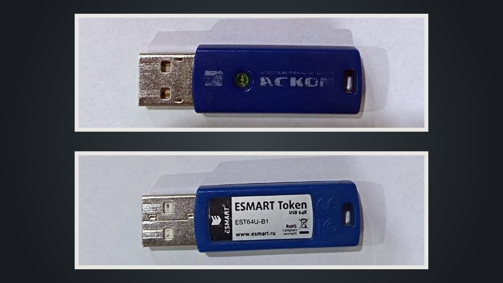
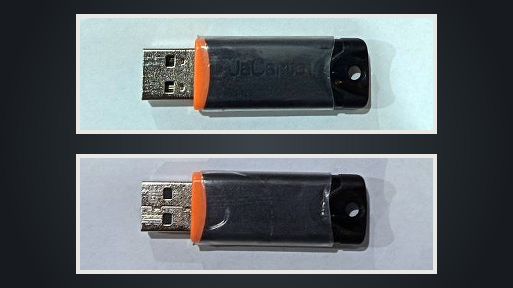
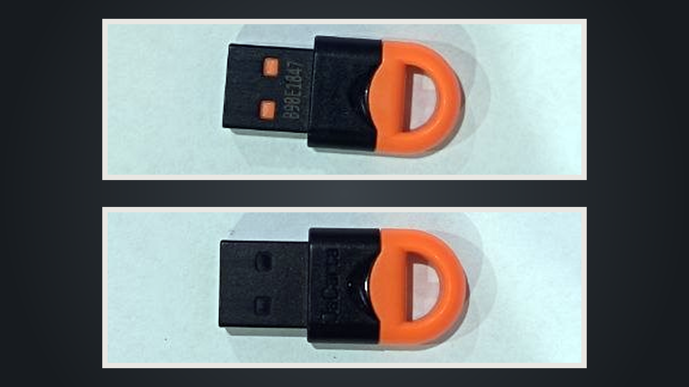
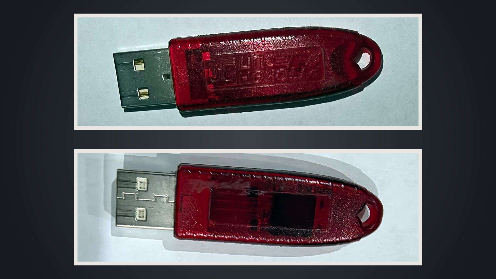
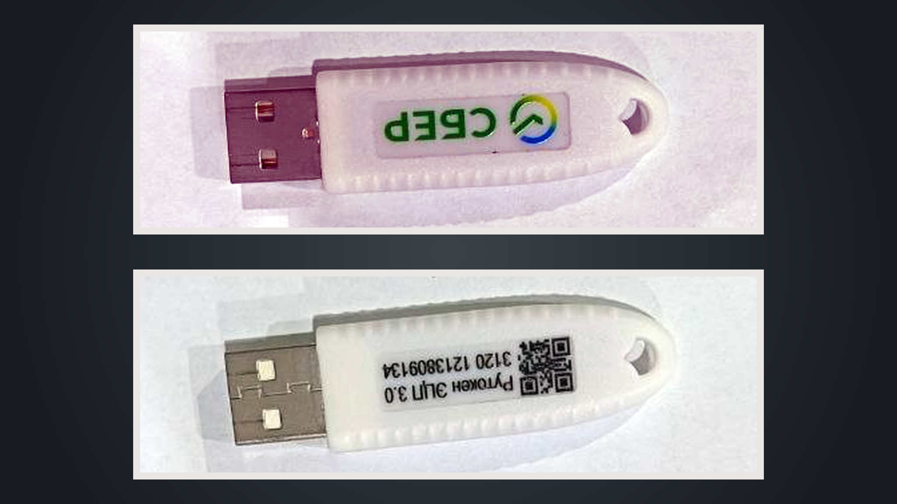
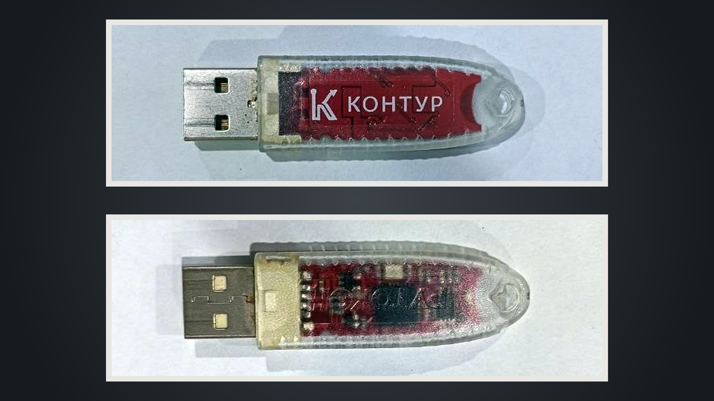
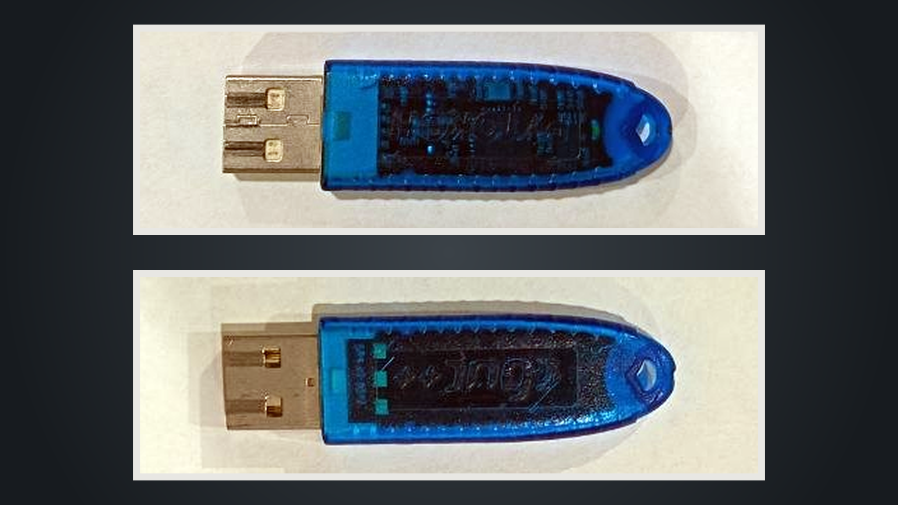
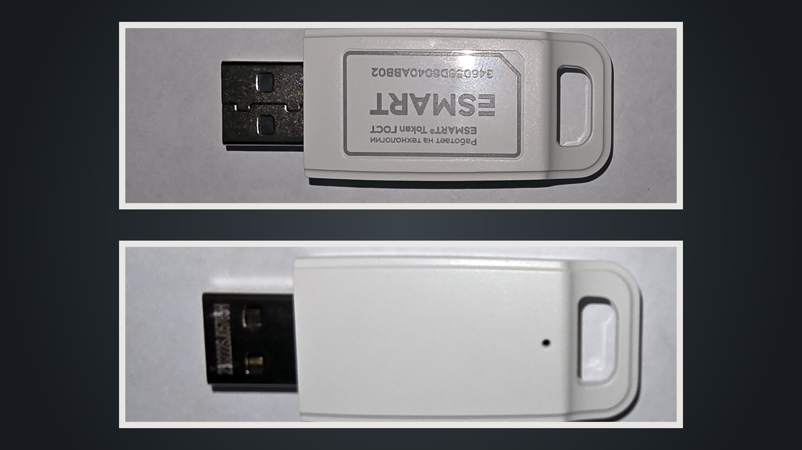

# Каноническая фотосерия физических USB-токенов

Срез объединяет десять точно идентифицированных физических экземпляров: eToken PRO,
восемь моделей от 27.08.2026 и ESMART Token ГОСТ (добавлен 02.09.2026). Два оригинала
в каждом каталоге остаются доказательными файлами, а `studio`-кадр служит только
для навигации и визуального сравнения. Модельная идентификация и аппаратные
признаки приведены в [рыночной и лабораторной матрице](token-market.md).

## Галерея

| eToken PRO | ESMART Token | ESMART Token USB 64K |
|---|---|---|
| [](images/etoken-pro/etoken-pro-front-rear-studio.png) | [](images/esmart-token/esmart-token-front-rear-studio.png) | [](images/esmart-token-usb64k/esmart-token-usb64k-front-rear-studio.png) |
| JaCarta LT | JaCarta LT Nano | Рутокен ЭЦП 2.0 |
| [](images/jacarta-lt/jacarta-lt-front-rear-studio.png) | [](images/jacarta-lt-nano/jacarta-lt-nano-front-rear-studio.png) | [](images/rutoken-ecp-2/rutoken-ecp-2-front-rear-studio.png) |
| Рутокен ЭЦП 3.0 | Рутокен Lite | Рутокен S |
| [](images/rutoken-ecp-3/rutoken-ecp-3-front-rear-studio.png) | [](images/rutoken-lite/rutoken-lite-front-rear-studio.png) | [](images/rutoken-s/rutoken-s-front-rear-studio.png) |
| ESMART Token ГОСТ | | |
| [](images/esmart-token-gost/esmart-token-gost-front-rear-studio.png) | | |

## Воспроизводимая обработка

Канонические кадры собирает
[`build/token-photo-series.ps1`](../build/token-photo-series.ps1):

```powershell
pwsh build/token-photo-series.ps1
```

Для выборочной пересборки доступен параметр `-Model <slug>`. Проверенная среда —
ImageMagick `7.1.2-27 Q16-HDRI x64`.

- каждый ракурс берётся прямо из соответствующего `*-original.jpg/png`;
- EXIF-ориентация нормализуется в пиксели через `-auto-orient` **до** поворота: снимки
  ESMART Token ГОСТ несут флаг `Orientation=RightTop`, а разные операции ImageMagick
  применяют его непоследовательно; для оригиналов без флага (`Undefined`) это no-op, и
  прежние девять `studio`-файлов остаются байт-в-байт прежними;
- разрешены только явно записанные в скрипте повороты на `0°`, `90°` или `180°`,
  crop, масштабирование и компоновка; отражение, маска, генеративная дорисовка и
  локальная ретушь не используются;
- все crop-окна имеют соотношение `22:7`, поэтому перевод в `1408×448` через
  Lanczos не меняет пропорции устройства;
- одинаковая контрастная нормализация каждого ракурса выполняется в `sRGB`
  командой ImageMagick `-channel RGB -contrast-stretch 0.20%x0.20% +channel`;
  она отбрасывает только по `0,20%` крайних тонов с каждой стороны гистограммы и
  не применяет локальную коррекцию к надписям или дефектам;
- внутренний кадр `1408×448` получает рамку `16 px`; две панели `1440×480`
  размещаются в точках `304,56` и `304,616` на едином графитовом холсте
  `2048×1152`;
- PNG очищаются от метаданных и сохраняются как 8-битный `sRGB` RGB.

Два последовательных полных запуска на одной проверенной версии ImageMagick дали
одинаковые SHA-256 всех десяти `studio`-файлов.

## Размеры и SHA-256

### eToken PRO

| Файл | Размер | Байты | SHA-256 |
|---|---:|---:|---|
| [front-original](images/etoken-pro/etoken-pro-front-original.png) | `1920×2560` | 4414723 | `49d8fe08c673cee3b13da3f8eb7ab6617fcc9d3b65b7e7bcae51b83e41b57543` |
| [rear-original](images/etoken-pro/etoken-pro-rear-original.png) | `1920×2560` | 4810279 | `0a6a4bd7aa71f0c337f0d97944ae5df3d24c4346a24627d76657d0a71c633f26` |
| [front-rear-studio](images/etoken-pro/etoken-pro-front-rear-studio.png) | `2048×1152` | 2127791 | `62c4c16ec6fdc2547fd0b38567415d6061ba7111ab43e220a6da6e2ceac189bb` |

### ESMART Token

| Файл | Размер | Байты | SHA-256 |
|---|---:|---:|---|
| [front-original](images/esmart-token/esmart-token-front-original.jpg) | `957×1280` | 80453 | `59adef7e98cb7b54d8a8ce9cef2db8ad68577a1f7c44a459926d7d64c20a909c` |
| [rear-original](images/esmart-token/esmart-token-rear-original.jpg) | `957×1280` | 65667 | `cdc24d431a188079cacfcb69021abd2bdb2802f60c9a5ddf6e92cf0d573f3d45` |
| [front-rear-studio](images/esmart-token/esmart-token-front-rear-studio.png) | `2048×1152` | 999970 | `dcf380bee50819ceea942ffa3e09b9a3193cc4c5f601ac708fbc1060503bfaf8` |

### ESMART Token USB 64K

| Файл | Размер | Байты | SHA-256 |
|---|---:|---:|---|
| [front-original](images/esmart-token-usb64k/esmart-token-usb64k-front-original.jpg) | `957×1280` | 80597 | `8aaa3878d8b79746b6a44fdf3ae3fe7d5ab48bc855251c1e2d7eae9c3348d21a` |
| [rear-original](images/esmart-token-usb64k/esmart-token-usb64k-rear-original.jpg) | `957×1280` | 72757 | `6bcf95890b721624d79d0338b79f58dd56c92ae190c4fd5471da9338adb57b14` |
| [front-rear-studio](images/esmart-token-usb64k/esmart-token-usb64k-front-rear-studio.png) | `2048×1152` | 1122310 | `c2e561bb90261fdac0e13f6b30ab535c2341f352d5120bed4b8d05881c4aef68` |

### JaCarta LT

| Файл | Размер | Байты | SHA-256 |
|---|---:|---:|---|
| [front-original](images/jacarta-lt/jacarta-lt-front-original.jpg) | `957×1280` | 99187 | `58b1273d4874e549c79cb31c8f46df470056b4f44efc7c780f57f77989279376` |
| [rear-original](images/jacarta-lt/jacarta-lt-rear-original.jpg) | `957×1280` | 99667 | `3ee7a0992e32d640eaab514bedc0c614d6c6291220a335bb6d948248c66256f2` |
| [front-rear-studio](images/jacarta-lt/jacarta-lt-front-rear-studio.png) | `2048×1152` | 1047357 | `f1b5777120267ea7018f322b99d799907f9474c94be81cee5035ac375c1f6c78` |

### JaCarta LT Nano

| Файл | Размер | Байты | SHA-256 |
|---|---:|---:|---|
| [front-original](images/jacarta-lt-nano/jacarta-lt-nano-front-original.jpg) | `957×1280` | 81784 | `9eaa307a5ad8709764651c5c628d9765742aca0b6ab5ea3762a199db50b44d83` |
| [rear-original](images/jacarta-lt-nano/jacarta-lt-nano-rear-original.jpg) | `957×1280` | 67557 | `5ad7c133c6c80c37f031cd5a2ad0b64a28fd17a051826e9f4d52dcabae30f14b` |
| [front-rear-studio](images/jacarta-lt-nano/jacarta-lt-nano-front-rear-studio.png) | `2048×1152` | 890017 | `69a5047c90b0660cfb14792a86b0e3c43b80b7906d84a36e5d3cfdc43257faa7` |

### Рутокен ЭЦП 2.0

| Файл | Размер | Байты | SHA-256 |
|---|---:|---:|---|
| [front-original](images/rutoken-ecp-2/rutoken-ecp-2-front-original.png) | `2560×1920` | 3497739 | `c42499d857b5b1d3a68d91159e3708bb32d407a2d4ab2951675df451409e20be` |
| [rear-original](images/rutoken-ecp-2/rutoken-ecp-2-rear-original.png) | `2560×1920` | 2391157 | `f2c8abe3fb05b8832769e6f889f51e8e8d2acb0742544388102858e5b2b1e506` |
| [front-rear-studio](images/rutoken-ecp-2/rutoken-ecp-2-front-rear-studio.png) | `2048×1152` | 1477169 | `70be6210c299728a496407b58a2a08f67022db061623c1b26b1585de03f6730b` |

### Рутокен ЭЦП 3.0

| Файл | Размер | Байты | SHA-256 |
|---|---:|---:|---|
| [front-original](images/rutoken-ecp-3/rutoken-ecp-3-front-original.jpg) | `957×1280` | 94886 | `cf3e6a156f562654aa8b87425f56d58ea74b6c4df553c3bcd4f143f4b78312e3` |
| [rear-original](images/rutoken-ecp-3/rutoken-ecp-3-rear-original.jpg) | `957×1280` | 113755 | `cef3e154e5d272d20b63f806ded105f230419771d54968b3cdd0ea9c2b544414` |
| [front-rear-studio](images/rutoken-ecp-3/rutoken-ecp-3-front-rear-studio.png) | `2048×1152` | 1032374 | `9feb4c5915ccccbf1a9587d05521492cfc17cb68675af97e3a58216ff4802432` |

### Рутокен Lite

| Файл | Размер | Байты | SHA-256 |
|---|---:|---:|---|
| [front-original](images/rutoken-lite/rutoken-lite-front-original.jpg) | `957×1280` | 76038 | `3c4f5f7b05ff4411302f602bf1f605c40414eaf174b6931c14c32675400a601c` |
| [rear-original](images/rutoken-lite/rutoken-lite-rear-original.jpg) | `957×1280` | 71632 | `579cf7633377968e47c62b93dead362f75cf98c4aba514a342f5da7648893e7c` |
| [front-rear-studio](images/rutoken-lite/rutoken-lite-front-rear-studio.png) | `2048×1152` | 1364890 | `0b81cbd8cf8033de865bf1d3bda085c926f836b3a93fa6a8371eb08f4ba5df3c` |

### Рутокен S

| Файл | Размер | Байты | SHA-256 |
|---|---:|---:|---|
| [front-original](images/rutoken-s/rutoken-s-front-original.jpg) | `957×1280` | 100890 | `3d339fca72961c7bbe3d1da4ae8ba6600aa81dd22819188ea0013f22c3629164` |
| [rear-original](images/rutoken-s/rutoken-s-rear-original.jpg) | `957×1280` | 94416 | `ba31587e9823c83247e1ba21e0f297bfb538eb8c0352f43439fd77850a3e0a6b` |
| [front-rear-studio](images/rutoken-s/rutoken-s-front-rear-studio.png) | `2048×1152` | 1189536 | `d402da83aad7301898386eb8fe3d15e1dd144f59e10d902548afd620e25dbb12` |

### ESMART Token ГОСТ

Оригиналы сняты телефоном и несут EXIF `Orientation=RightTop` (хранимые пиксели
`4000×3000`, к просмотру разворачиваются в `3000×4000`); сборка нормализует их
`-auto-orient` до поворота.

| Файл | Размер | Байты | SHA-256 |
|---|---:|---:|---|
| [front-original](images/esmart-token-gost/esmart-token-gost-front-original.jpg) | `4000×3000` | 1438228 | `fa21c3116c2af0293647c9863313059560dadd070e686cf3aa85d5849dcf7fa4` |
| [rear-original](images/esmart-token-gost/esmart-token-gost-rear-original.jpg) | `4000×3000` | 1245790 | `fe26d291b080511ccd51579a2766808c906d781b5c078c0fd9b67b6655e407c6` |
| [front-rear-studio](images/esmart-token-gost/esmart-token-gost-front-rear-studio.png) | `2048×1152` | 1267490 | `64eb0f3f53bc151a1d0a00fa15a142b39fd682b862b2d6f471349d5940bafaf5` |

## Проверки приёмки

- в каждом из десяти модельных каталогов ровно три файла;
- 16 новых оригиналов побайтово совпадают с локальными raw-источниками по
  SHA-256; два оригинала eToken PRO также не изменены; два оригинала ESMART Token
  ГОСТ совпадают с исходными кадрами телефона;
- все десять `studio`-кадров имеют `2048×1152`, лицевую сторону сверху,
  обратную снизу и USB-штекер слева;
- каждый итоговый кадр сверялся с оригиналами на полном размере; надписи,
  контакты, отверстия, царапины и геометрия сохранены;
- у ESMART Token ГОСТ наклейка напечатана для штекера справа, поэтому при
  каноническом «штекер слева» лицевой текст читается перевёрнутым (как перевёрнутый
  стикер на существующем ESMART Token) — все символы сохранены, зеркалирование не
  применялось;
- серийная маркировка Рутокен ЭЦП 3.0 остаётся только внутри доказательной
  фотографии и не переносится в текст.
